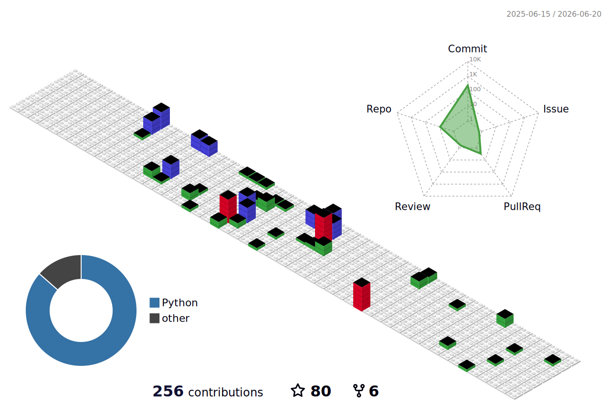

<!-- 打字机效果 -->

  

<!-- Views/ Followers / Stars / Forks -->

  
  
  
  <!--    -->

| GitHub Stats [Cleste] | Changes in stars [Papers] |
|:-:|:-:|
|  |  |

<!-- <picture>
  <source media="(prefers-color-scheme: dark)" srcset="https://raw.githubusercontent.com/cleste-pome/cleste-pome/output/github-contribution-grid-snake-dark.svg">
  <source media="(prefers-color-scheme: light)" srcset="https://raw.githubusercontent.com/cleste-pome/cleste-pome/output/github-contribution-grid-snake.svg">
  
</picture> -->
