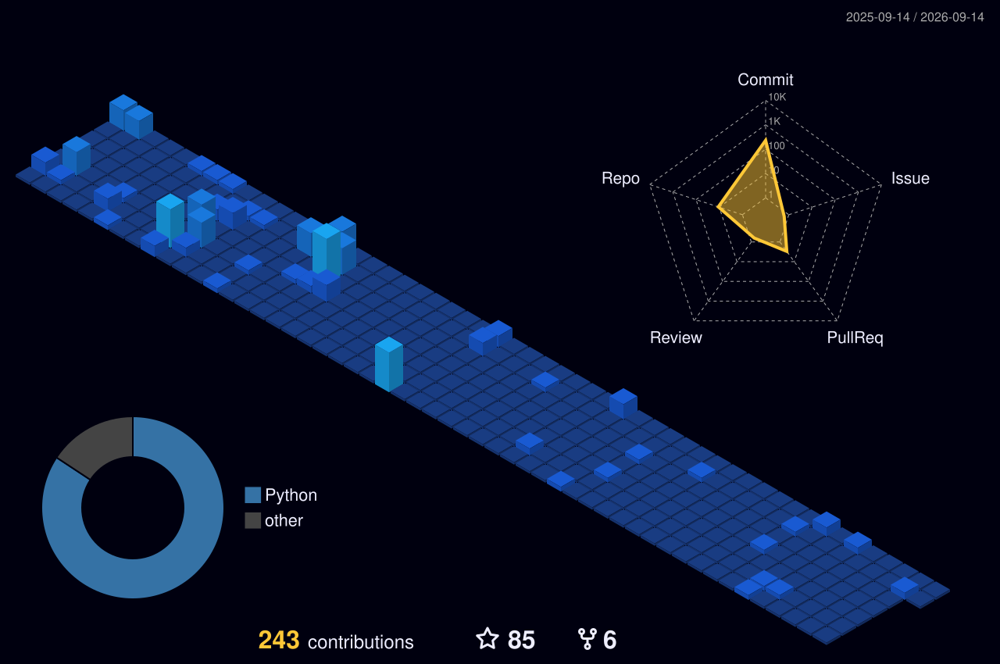

<!-- 打字机效果 -->

  

<!-- Views/ Followers / Stars / Forks -->

  
  
  
  <!--    -->

<!-- 表格开始：左侧3D贡献图，右侧Star历史曲线图 -->
| GitHub Contributions [Cleste] | Changes in Stats [Projects] |
|:-:|:-:|
|  | <a href="https://www.star-history.com/?repos=cleste-pome%2Fundergraduate-graduation-project%2Ccleste-pome%2Fsparsemvc%2Ccleste-pome%2Fgmae%2Ccleste-pome%2Fmasa&type=date&legend=top-left"><picture><source media="(prefers-color-scheme: dark)" srcset="https://api.star-history.com/chart?repos=cleste-pome/undergraduate-graduation-project%2Ccleste-pome/sparsemvc%2Ccleste-pome/gmae%2Ccleste-pome/masa&type=date&theme=dark&legend=top-left" /><source media="(prefers-color-scheme: light)" srcset="https://api.star-history.com/chart?repos=cleste-pome/undergraduate-graduation-project%2Ccleste-pome/sparsemvc%2Ccleste-pome/gmae%2Ccleste-pome/masa&type=date&legend=top-left" /></picture></a> |
<!-- 表格结束 -->

<b>Click to expand my not-so-serious bio 😄</b>

  <h3>🧙‍♂️ A bit about me</h3>
  

    🌱 <i>Name:</i> <b>Liu Ruimeng</b> (but you can call me cleste – like "celeste").   
    📖 <i>School:</i> <b>China University of Geoscience (Bachelor & Master)  
       Huazhong University of Science and Technology (Pursue a Ph.D.)</b>. 
    🔭 <i>Currently:</i> Diving into <b>unsupervised representation learning</b> & making papers less lonely. 
    💻 <i>Learning:</i> How to tell my advisor that I've been tuning hyperparameters for a week. 
    ⚡ <i>Secret skill:</i> If it works, don't touch it. If it doesn't work, StackOverflow (Codex/ClaudeCode) it. 
  

  

    
    &nbsp;&nbsp;
    
  &nbsp;&nbsp;
    
  

