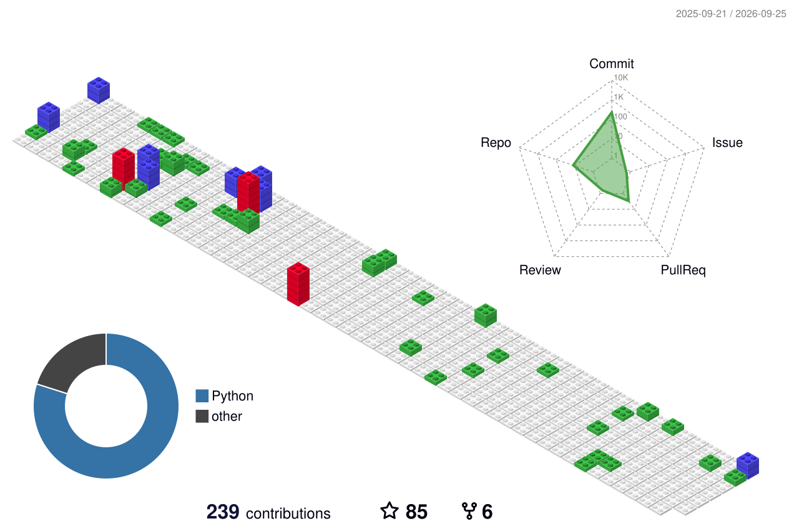

<!-- 打字机效果 -->

  

<!-- Views/ Followers / Stars / Forks -->

  
  
  
  <!--    -->

| GitHub Stats [Cleste] | Changes in stars [Projects] |
|:-:|:-:|
|  |  |

<!-- <picture>
  <source media="(prefers-color-scheme: dark)" srcset="https://raw.githubusercontent.com/cleste-pome/cleste-pome/output/github-contribution-grid-snake-dark.svg">
  <source media="(prefers-color-scheme: light)" srcset="https://raw.githubusercontent.com/cleste-pome/cleste-pome/output/github-contribution-grid-snake.svg">
  
</picture> -->

<b>Click to expand my not-so-serious bio 😄</b>

  <h3>🧙‍♂️ A bit about me</h3>
  

    🌱 <i>Name:</i> <b>Liu Ruimeng</b> (but you can call me cleste – like "celeste").   
    📖 <i>School:</i> <b>China University of Geoscience (Bachelor & Master)  
       Huazhong University of Science and Technology (Pursue a Ph.D.)</b>. 
    🔭 <i>Currently:</i> Diving into <b>unsupervised representation learning</b> & making papers less lonely. 
    💻 <i>Learning:</i> How to tell my advisor that I've been tuning hyperparameters for a week. 
    ⚡ <i>Secret skill:</i> If it works, don't touch it. If it doesn't work, StackOverflow (Codex/ClaudeCode) it. 
  

  <!-- 

    
    
  
 -->

